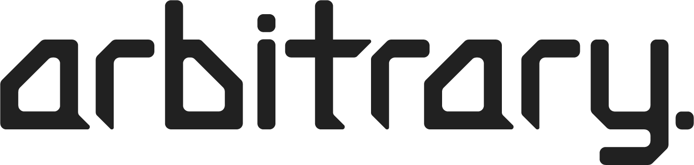

https://arbitrari.dev
___
Welcome to the repository for the portfolio website for arbitrari. We are a software development group that primarily makes applications and tools revolving around Tesla vehicles.

## Develop
This is an Angular application, so when you clone the repository, you must run `npm install` to grab all dependencies, and then use `ng serve` to host a live development copy at `http://localhost:4200`. This should be familiary with you if you are an Angular developer.

## Deploy
Deployment is handled automatically by a GitHub Action that runs on every push and pull request to the master branch. Assuming there are no issues, it will place the built files in the _gh-pages_ branch, which is then served by GitHub Pages.

## May I Join The Team?
All of our projects are open-source and hosted in public GitHub repositories. If you have ideas for improvements, leave the idea in the issues of the project's repo and consider making a pull request. If we like the idea, and all looks good, we'll add it!

If your work is really good, we will consider adding you on to the development team.